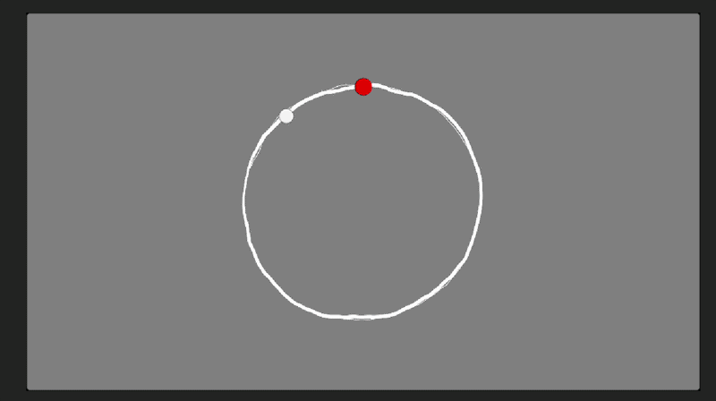

# Process Journal

## 03.30.26 | A Shared Experience

What if you took [IE](https://www.mouseandthebillionaire.com/ie/), but split it in half? One person could hear the audio, and another could see the visuals. Both have ways to manipulate the entire experience, but can only understand half of what is going on. Can the Eye communicate to the Ear in such a way to successfully solve the puzzle? And vice-versa? Is that even fun?

There's lots of exciting places this can go. We brainstorm and (unsurprisingly) the ideas quickly get very involved. Very large and grandiose. There are rabbit ears, and holding hands in front of your face, and a Severence-style clacky keyboard with odd heiroglyphics that you have to occasionaly hit like the Fonze to make work. There is a wonky headphone jack that you have to hold a certain way. There are hot-swap style buttons that change different aspects of what the large dials do. 

How do we make this novel and fun? How do we distill this down to the essentials?

How about a shared circular rhythm game where the Eye sees what the Ear needs to play. The Ear hears the filter cutoff that the Eye cannot see. The Eye can communicate to the Ear by making the noise at the appropriate time. "Repeat after me." But how does the Ear communicate to the Eye? Do heirgolyphs hint at commands? At suggested behavior? Does a key that plays an upward trill trigger a related symbol on the Eye's screen?

What does hot sound like? Cold? Yes!? No? Almost? What other suggestions should there be? An exciting prospect is that two players might use the system to communicate in ways not even intended by us. They could create a language all their own within the parameters that we put down.

